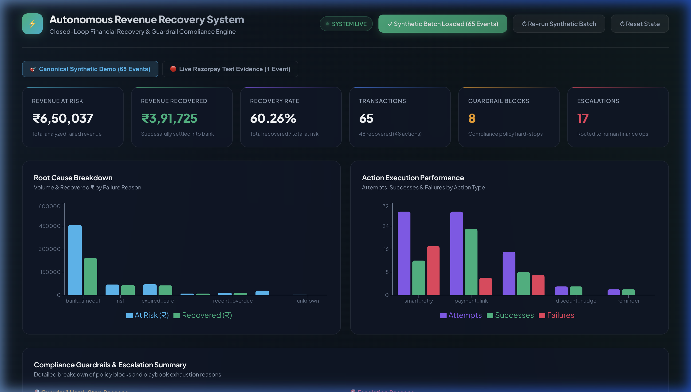
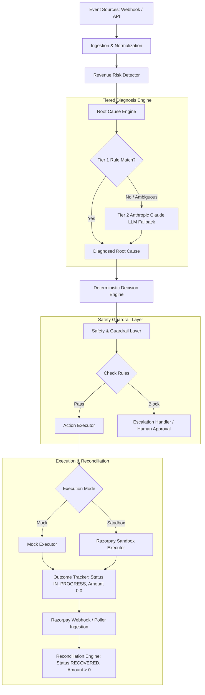
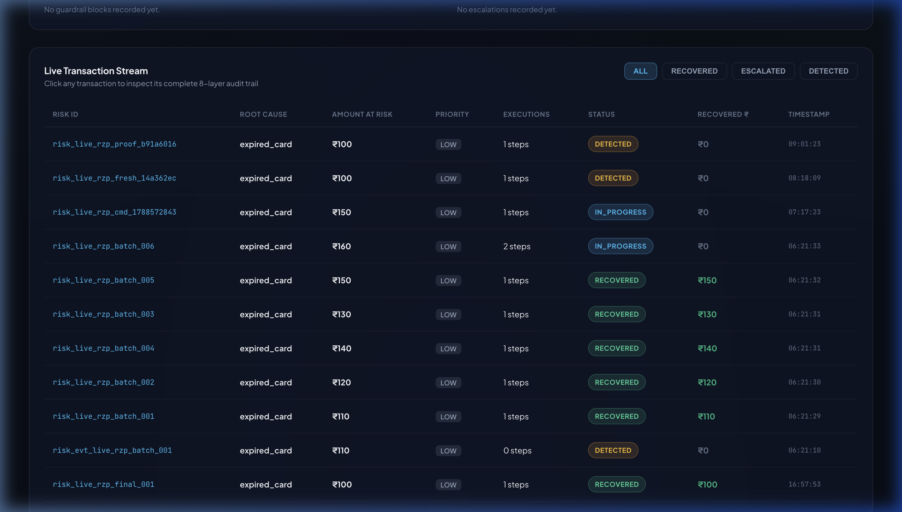
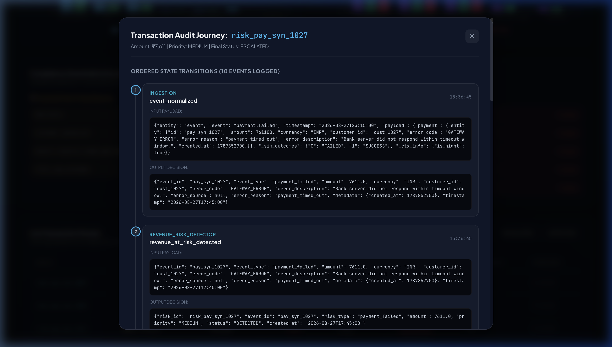

# Autonomous AI Revenue Recovery System

> **"Turn failed payments into controlled, traceable recovery actions with deterministic guardrails and verified Razorpay reconciliation."**

[](https://www.python.org/)
[](https://fastapi.tiangolo.com/)
[](https://razorpay.com/)
[](tests/)

---

## 📊 Demo

### Web Dashboard Overview



#### Canonical 65-Event Benchmark Results (SYNTHETIC DEMO RESULTS)
*The system evaluated 65 deterministic synthetic payment failure events covering all 6 root cause categories, LLM fallbacks, and compliance guardrails:*

- **Total Transactions Analyzed**: `65`
- **Total Revenue at Risk**: `₹650,037.00`
- **Total Revenue Recovered**: `₹391,725.00`
- **Overall Recovery Rate**: `60.26%`
- **Recovered Transactions**: `48`
- **Guardrail Compliance Blocks**: `8`
- **Escalations to Ops**: `17`

> [!NOTE]
> The numbers above represent the canonical **SYNTHETIC DEMO RESULTS** generated by `demo_rehearsal.py` for reproducible benchmark testing.

---

## 🏗️ Architecture



> [!IMPORTANT]
> **The LLM is NOT the financial control plane.** The LLM is strictly constrained to root-cause text classification. Recovery actions, guardrail enforcement, API dispatch, and financial reconciliation are governed 100% by deterministic code.

---

## 🧠 AI / Root Cause Intelligence

The system employs a **Tiered Diagnosis Engine** to diagnose payment failure causes:

1. **Tier 1 (Deterministic Rule-Based Diagnosis)**: Ultra-fast regex and error code matching for known gateway errors (e.g. `payment_timed_out` $\rightarrow$ `bank_timeout`, `insufficient_funds` $\rightarrow$ `nsf`, `card_expired` $\rightarrow$ `expired_card`).
2. **Tier 2 (Bounded LLM Fallback)**: When an unmapped or ambiguous error occurs, the event is passed to an Anthropic Claude LLM fallback wrapped with a **3.0s strict timeout**. If the LLM times out or fails, the system safely defaults to `UNKNOWN`.
3. **Structured Output**: Returns strict Pydantic schemas containing `root_cause`, `confidence`, and `reasoning`.

### Strict LLM Constraints
The LLM is **never** permitted to:
- Choose arbitrary financial recovery actions.
- Bypass guardrail compliance checks.
- Directly invoke Razorpay API endpoints.
- Mark transactions as `RECOVERED`.
- Alter subsequent playbook steps.

---

## ⚙️ Deterministic Decision Engine

Interventions are selected strictly from deterministic recovery playbooks based on the diagnosed root cause:

| Diagnosed Root Cause | Step 1 Action | Step 2 Action (If Step 1 Fails) | Terminal Fallback |
|---|---|---|---|
| `bank_timeout` | `smart_retry` | `payment_link` | `escalate` (Playbook Exhausted) |
| `nsf` | `delayed_retry` | `payment_link` | `escalate` (Playbook Exhausted) |
| `expired_card` | `payment_link` | — | `escalate` (Playbook Exhausted) |
| `cart_abandonment` | `discount_nudge` (`RECOVER10`) | — | `escalate` (Playbook Exhausted) |
| `recent_overdue` | `reminder` | — | `escalate` (Playbook Exhausted) |
| `chronic_non_payer` | `escalate` | — | Immediate Escalation |

Selected actions originate strictly from controlled playbooks rather than unconstrained LLM reasoning.

---

## 🛡️ Safety & Guardrails

Before any intervention action is executed, the **Guardrail Layer** evaluates safety and policy constraints:

- **Customer Opt-Out Check**: Hard-stop if customer has opted out.
- **Retry Limit Cap**: Prevents retrying more than 3 times per transaction.
- **Do-Not-Disturb (DND) Hours**: Blocks customer outreach between 9:00 PM and 9:00 AM.
- **Human Approval Threshold**: Requires manual approval for transactions > ₹50,000.
- **Business & Fraud Rules**: Ensures safe operational limits.

### Guardrail Control Flow
- **GUARDRAIL PASS**: Action proceeds to Action Executor.
- **GUARDRAIL BLOCK**: Action is blocked; event immediately escalates to human ops without executing the action.

---

## 🔄 Execution vs. Financial Recovery

A foundational safety invariant of this architecture is the strict separation between action dispatch and financial recovery:

> **Action execution `SUCCESS` does NOT mean financial recovery.**

### Lifecycle Example
1. **Action Execution**:
   - `execution_status`: `SUCCESS` (Action dispatched successfully)
   - `amount_recovered`: `₹0.00`
   - `event_status`: `IN_PROGRESS`
2. **Verified Reconciliation**:
   - External payment evidence verified via Razorpay webhook or poller daemon
   - `reconciliation`: `payment_status_reconciled_recovered`
   - `amount_recovered`: `₹110.00`
   - `event_status`: `RECOVERED`

This invariant prevents false revenue accounting prior to verified external payment confirmation.

---

## 💳 Razorpay Integration


*(Above: Verified Razorpay Test Mode transaction — not a production-money transaction).*

The system integrates natively with Razorpay Test Mode:
- **Payment Link Creation**: Automatically generates genuine Razorpay Payment Links (`plink_...`) via the Razorpay API.
- **HMAC-SHA256 Signature Verification**: Validates all incoming webhook payloads using `x-razorpay-signature` and `RAZORPAY_WEBHOOK_SECRET`.
- **Event Deduplication**: Prevents double-processing using `x-razorpay-event-id` idempotency records.
- **Reference ID Correlation**: Maps Razorpay `reference_id` directly to system `risk_id`.

### Verified Test Mode Evidence (`risk_live_rzp_batch_001`)
- **Risk ID**: `risk_live_rzp_batch_001`
- **Amount**: `₹110.00`
- **Payment Link ID**: `plink_TYLTGzFyrHp3rO`
- **Razorpay Payment ID**: `pay_TYLXClQ37D9JXI`
- **Payment Status**: `captured`
- **Final System Status**: `RECOVERED`
- **Amount Recovered**: `₹110.00`
- **Financial Recovery Verified**: `true`
- **Execution Mode**: `sandbox`
- **Simulated**: `false`
- **Fallback Applied**: `false`

---

## 🔒 Webhook Security & Provenance

The Webhook Processor enforces strict security and provenance rules:
- **Cryptographic Validation**: Rejects webhooks with invalid HMAC signatures.
- **Idempotency**: Skips duplicate event IDs (`is_duplicate_event`).
- **Provenance Routing**:
  - `risk_live_*` $\rightarrow$ Routed to live database (`live_razorpay.db`).
  - `risk_pay_syn_*` $\rightarrow$ Synthetic events (never called against Razorpay API).
  - Unattributed / Unknown Webhooks $\rightarrow$ Isolated into `unattributed_webhooks.db` rather than automatically attributed.

---

## 🗄️ Data Isolation

To prevent synthetic benchmark data from polluting genuine integration test evidence, the system isolates databases:

- **`recovery.db`**: Stores synthetic demo benchmark data (65 events).
- **`live_razorpay.db`**: Stores genuine Razorpay Test Mode execution and webhook evidence.
- **`unattributed_webhooks.db`**: Isolates unverified or missing-provenance webhooks.

This strict separation ensures synthetic events are never represented as real external transactions.

---

## 🔍 Audit Lineage & Traceability



Every transaction maintains an append-only, 9-layer decision lineage (`audit_log`):
1. `ingestion` (`event_normalized`)
2. `revenue_risk_detector` (`revenue_at_risk_detected`)
3. `root_cause_engine` (`root_cause_identified`)
4. `decision_engine` (`action_selected`)
5. `guardrail` (`guardrail_pass` / `guardrail_block`)
6. `action_executor` (`action_executed`)
7. `outcome_tracker` (`outcome_recorded`)
8. `outcome_tracker` (`action_execution_succeeded`, `amount_recovered: 0.0`)
9. `reconciliation_engine` (`payment_status_reconciled_recovered`, `amount_recovered: >0`)

---

## ⚡ Additional Implemented Capabilities

- **B2B Receivables Recovery**: Multi-tier invoice recovery workflow for enterprise overdue accounts (reminder $\rightarrow$ CRM escalation $\rightarrow$ partner collections).
- **Bounded Information Gathering**: Clarification workflow when failure cause is ambiguous, asking customers for missing context before resuming recovery.
- **Hinglish Voice Recovery Engine**: Voice interaction processing, STT intent extraction ("Payment link bhej do"), and agent intent execution.

---

## 🚀 Quick Start Guide

### 1. Clone & Setup Environment
```bash
git clone https://github.com/your-username/ai-revenue-recovery.git
cd ai-revenue-recovery

# Create and activate virtual environment
python3 -m venv .venv
source .venv/bin/activate

# Install dependencies
pip install -r requirements.txt
```

### 2. Configure Environment Variables
Copy `.env.example` to `.env`:
```bash
cp .env.example .env
```

### 3. Run Test Suite
```bash
./.venv/bin/pytest -q
```
*Runs the full test suite (175 passed).*

### 4. Run Benchmark Rehearsal
```bash
./.venv/bin/python demo_rehearsal.py
```
*Executes the double rehearsal pass on the canonical synthetic benchmark.*

### 5. Launch Server & Dashboard
```bash
./.venv/bin/uvicorn src.server:app --port 8000 --host 127.0.0.1
```
Open your browser and navigate to: **`http://127.0.0.1:8000/`**

---

## 🧪 Testing Verification

- **Pytest Results**: `175 passed` out of 175 unit/integration tests.
- **Demo Rehearsal Results**:
  - `65` transactions processed
  - `₹650,037.00` revenue at risk
  - `₹391,725.00` revenue recovered
  - `60.26%` overall recovery rate

---

## 📂 Repository Structure

```text
ai-revenue-recovery/
├── assets/
│   └── screenshots/
│       ├── dashboard_overview.png
│       ├── audit_lineage_modal.png
│       ├── live_evidence_tab.png
│       └── live_razorpay_proof.png
├── src/
│   ├── audit.py             # Append-only audit logger
│   ├── batch_runner.py      # Synthetic batch generator & runner
│   ├── db.py                # Database connection & schema initializer
│   ├── decision_engine.py   # Deterministic recovery playbooks
│   ├── executor.py          # Action dispatch coordinator
│   ├── guardrails.py        # Safety & compliance rules engine
│   ├── info_gathering.py   # Customer clarification engine
│   ├── ingestion.py         # Event normalization
│   ├── llm.py               # Tier 2 Anthropic Claude LLM fallback
│   ├── metrics.py           # Revenue & recovery analytics
│   ├── models.py            # Pydantic domain models
│   ├── outcome_tracker.py   # Workflow state machine
│   ├── pipeline.py          # Event pipeline coordinator
│   ├── receivables.py       # B2B invoice recovery engine
│   ├── reconciliation.py    # Payment reconciliation & poller daemon
│   ├── risk_detector.py     # Revenue risk priority classifier
│   ├── root_cause.py        # Tier 1 rule-based root cause engine
│   ├── server.py            # FastAPI web server & background daemon
│   ├── voice.py             # Hinglish voice recovery engine
│   ├── webhook.py           # Razorpay HMAC verification & provenance
│   ├── integrations/        # Razorpay API client adapter & sandbox executor
│   └── static/              # React dashboard frontend UI
├── tests/                   # 175 unit & integration tests
├── demo_rehearsal.py        # Synthetic benchmark rehearsal script
├── .env.example             # Environment configuration template
└── README.md                # Project documentation
```

---

## ⚠️ Limitations & Scope Disclosures

- **Test Mode Integration**: Live Razorpay integration is demonstrated using Razorpay Test Mode / Sandbox API credentials.
- **Synthetic Benchmark**: Benchmark metrics reflect synthetic simulated data designed for hackathon testing.
- **Hackathon Implementation Scope**: This repository is a proof-of-concept hackathon implementation. Production deployment would require enterprise secret management, distributed queues, horizontal auto-scaling, and production monitoring.
