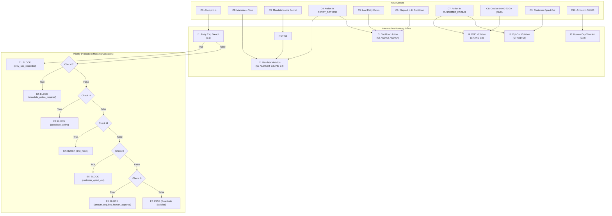
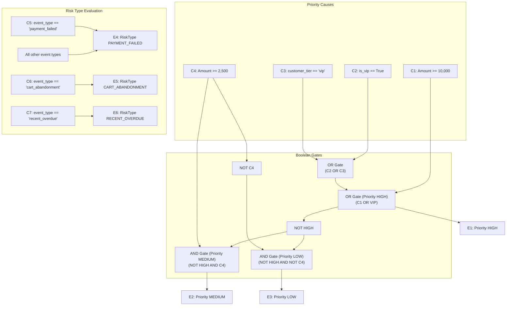
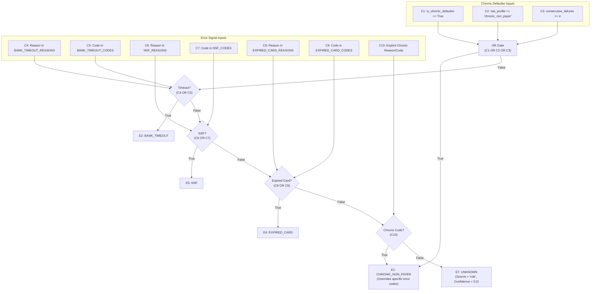
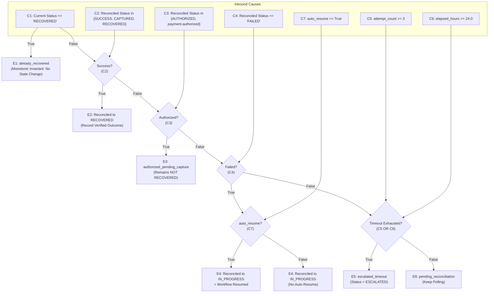
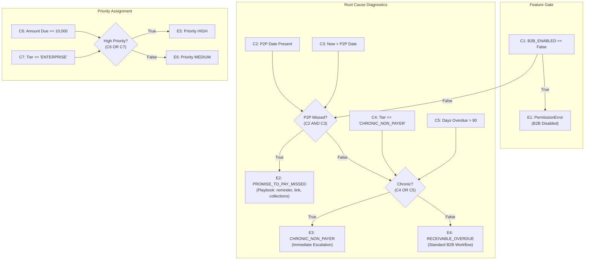

# Cause-Effect Graph Testing Specification

**Autonomous Revenue Recovery System — Software Testing FT3**  
**Technique**: Cause-Effect Graphing (Black-Box / Specification-Based Test Design)  
**Target Codebase**: `src/guardrails.py`, `src/risk_detector.py`, `src/root_cause.py`, `src/reconciliation.py`, `src/receivables.py`, `src/voice.py`, `src/info_gathering.py`

---

## 1. Introduction & Methodology

Cause-Effect Graphing is a formal specification-based testing technique designed by Glenford Myers to systematically evaluate complex combinations of input conditions (Causes) and their corresponding system outputs or state changes (Effects). 

Traditional testing techniques like Boundary Value Analysis (BVA) and Equivalence Class Partitioning (ECP) focus primarily on single input domains in isolation. Cause-Effect Graphing addresses **multi-variable interactions**, **Boolean logical dependencies** (AND, OR, NOT), and **priority masking constraints** where the evaluation of one condition supersedes or alters the evaluation of another.

### Standard Notation
- **Causes ($C_i$)**: Distinct Boolean input conditions or pre-conditions.
- **Intermediates ($I_j$)**: Logical combinational nodes resulting from Boolean operations ($\wedge$ AND, $\vee$ OR, $\neg$ NOT).
- **Effects ($E_k$)**: Observable system outputs, state transitions, audit decisions, or database mutations.
- **Constraints / Masking**: Priority order hierarchies where condition $A$ preempts condition $B$.

---

## 2. Subsystem 1: Deterministic Guardrails Engine (`src/guardrails.py`)

### 2.1 Causes & Effects Identification

The Guardrails engine evaluates proposed recovery actions across strict business and regulatory constraints (RBI e-mandate, DND windows, human authorization limits, and retry throttles).

| Cause ID | Description in Code | Code Condition |
| :--- | :--- | :--- |
| **$C_1$** | Attempt count exceeds retry limit | `ctx.attempt_number > 4` (`MAX_RETRY_ATTEMPTS`) |
| **$C_2$** | Transaction is an RBI e-mandate | `ctx.is_mandate == True` |
| **$C_3$** | Pre-debit mandate notice served | `ctx.mandate_notice_served == True` |
| **$C_4$** | Proposed action is a retry action | `action_type in {SMART_RETRY, DELAYED_RETRY}` |
| **$C_5$** | Prior retry timestamp exists | `ctx.last_retry_at is not None` |
| **$C_6$** | Retry cooldown active (< 4 hours) | `(ctx.current_time - ctx.last_retry_at).total_seconds() < 14400` |
| **$C_7$** | Action is customer-facing | `action_type in {PAYMENT_LINK, REMINDER, DISCOUNT_NUDGE}` |
| **$C_8$** | Time is within DND hours | `hour < 9 or hour >= 20` (`is_dnd_hours == True`) |
| **$C_9$** | Customer opted out of communications | `ctx.customer_opted_out == True` |
| **$C_{10}$** | Amount exceeds human approval cap | `amount > ctx.human_approval_threshold` (50,000.0) |

| Effect ID | System Action | Observable Result / Reason |
| :--- | :--- | :--- |
| **$E_1$** | Block: Retry Cap Exceeded | `GuardrailCheck(result=BLOCK, reason="retry_cap_exceeded")` |
| **$E_2$** | Block: Mandate Notice Required | `GuardrailCheck(result=BLOCK, reason="mandate_notice_required")` |
| **$E_3$** | Block: Cooldown Active | `GuardrailCheck(result=BLOCK, reason="cooldown_active")` |
| **$E_4$** | Block: DND Hours | `GuardrailCheck(result=BLOCK, reason="dnd_hours")` |
| **$E_5$** | Block: Customer Opted Out | `GuardrailCheck(result=BLOCK, reason="customer_opted_out")` |
| **$E_6$** | Block: Human Approval Required | `GuardrailCheck(result=BLOCK, reason="amount_requires_human_approval")` |
| **$E_7$** | Allow: Guardrail Passed | `GuardrailCheck(result=PASS, reason=None)` |

### 2.2 Boolean Logic & Priority Masking

The engine evaluates rules in strict numerical sequence. A higher-priority rule masks (suppresses) all lower-priority rules:

$$\begin{aligned}
I_1 &= C_1 \\
I_2 &= C_2 \wedge (\neg C_3) \wedge C_4 \\
I_3 &= C_5 \wedge C_6 \wedge C_4 \\
I_4 &= C_7 \wedge C_8 \\
I_5 &= C_9 \wedge C_7 \\
I_6 &= C_{10}
\end{aligned}$$

Final Cause $\to$ Effect Mappings:
$$\begin{aligned}
E_1 &= I_1 \\
E_2 &= (\neg I_1) \wedge I_2 \\
E_3 &= (\neg I_1) \wedge (\neg I_2) \wedge I_3 \\
E_4 &= (\neg I_1) \wedge (\neg I_2) \wedge (\neg I_3) \wedge I_4 \\
E_5 &= (\neg I_1) \wedge (\neg I_2) \wedge (\neg I_3) \wedge (\neg I_4) \wedge I_5 \\
E_6 &= (\neg I_1) \wedge (\neg I_2) \wedge (\neg I_3) \wedge (\neg I_4) \wedge (\neg I_5) \wedge I_6 \\
E_7 &= (\neg I_1) \wedge (\neg I_2) \wedge (\neg I_3) \wedge (\neg I_4) \wedge (\neg I_5) \wedge (\neg I_6)
\end{aligned}$$

### 2.3 Mermaid Graph: Guardrails Engine

---

## 3. Subsystem 2: Revenue Risk Detection (`src/risk_detector.py`)

### 3.1 Causes & Effects Identification

The Risk Detection module parses normalized inbound payment failure events to determine risk prioritization and risk categorization.

| Cause ID | Description in Code | Code Condition |
| :--- | :--- | :--- |
| **$C_1$** | Transaction amount $\ge$ 10,000.0 | `event.amount >= 10000.0` |
| **$C_2$** | Customer has VIP status | `event.metadata.get("is_vip") == True` |
| **$C_3$** | Customer tier is 'vip' | `event.metadata.get("customer_tier") == "vip"` |
| **$C_4$** | Transaction amount $\ge$ 2,500.0 | `event.amount >= 2500.0` |
| **$C_5$** | Event type is payment failure | `event.event_type == "payment_failed"` |
| **$C_6$** | Event type is cart abandonment | `event.event_type == "cart_abandonment"` |
| **$C_7$** | Event type is recent invoice overdue | `event.event_type == "recent_overdue"` |

| Effect ID | System Action | Observable Result |
| :--- | :--- | :--- |
| **$E_1$** | High Priority Assigned | `RiskEvent.priority = Priority.HIGH` |
| **$E_2$** | Medium Priority Assigned | `RiskEvent.priority = Priority.MEDIUM` |
| **$E_3$** | Low Priority Assigned | `RiskEvent.priority = Priority.LOW` |
| **$E_4$** | Risk Type Payment Failed | `RiskEvent.risk_type = RiskType.PAYMENT_FAILED` |
| **$E_5$** | Risk Type Cart Abandonment | `RiskEvent.risk_type = RiskType.CART_ABANDONMENT` |
| **$E_6$** | Risk Type Recent Overdue | `RiskEvent.risk_type = RiskType.RECENT_OVERDUE` |

### 3.2 Boolean Logic

$$\begin{aligned}
I_{VIP} &= C_2 \vee C_3 \\
I_{High} &= C_1 \vee I_{VIP} = C_1 \vee C_2 \vee C_3 \\
I_{Med} &= (\neg I_{High}) \wedge C_4 \\
I_{Low} &= (\neg I_{High}) \wedge (\neg C_4)
\end{aligned}$$

Effects:
$$\begin{aligned}
E_1 &= I_{High} \\
E_2 &= I_{Med} \\
E_3 &= I_{Low} \\
E_4 &= C_5 \vee (\neg C_5 \wedge \neg C_6 \wedge \neg C_7) \quad \text{(fallback to PAYMENT\_FAILED)} \\
E_5 &= C_6 \\
E_6 &= C_7
\end{aligned}$$

### 3.3 Mermaid Graph: Risk Detector

---

## 4. Subsystem 3: Root Cause Diagnostics Engine (`src/root_cause.py`)

### 4.1 Causes & Effects Identification

The Root Cause Engine diagnoses the fundamental payment failure mechanism using deterministic signal parsing and chronic defaulting criteria.

| Cause ID | Description in Code | Code Condition |
| :--- | :--- | :--- |
| **$C_1$** | Chronic non-payer metadata flag | `event.metadata.get("is_chronic_defaulter") == True` |
| **$C_2$** | Customer profile set to chronic non-payer | `event.metadata.get("customer_risk_profile") == "chronic_non_payer"` |
| **$C_3$** | High consecutive failures | `event.metadata.get("consecutive_failures") >= 4` |
| **$C_4$** | Known Bank Timeout error reason | `event.error_reason in BANK_TIMEOUT_REASONS` |
| **$C_5$** | Known Bank Timeout error code | `event.error_code in BANK_TIMEOUT_CODES` |
| **$C_6$** | Known NSF error reason | `event.error_reason in NSF_REASONS` |
| **$C_7$** | Known NSF error code | `event.error_code in NSF_CODES` |
| **$C_8$** | Known Expired Card error reason | `event.error_reason in EXPIRED_CARD_REASONS` |
| **$C_9$** | Known Expired Card error code | `event.error_code in EXPIRED_CARD_CODES` |
| **$C_{10}$** | Explicit chronic reason or code | `reason in chronic_reasons or code in chronic_codes` |
| **$C_{11}$** | Fallback / unmapped error signals | `All error codes/reasons unrecognized` |

| Effect ID | Root Cause Diagnostic | Confidence / Source |
| :--- | :--- | :--- |
| **$E_1$** | `CHRONIC_NON_PAYER` | Confidence 1.0, Source="rule" |
| **$E_2$** | `BANK_TIMEOUT` | Confidence 1.0, Source="rule" |
| **$E_3$** | `NSF` | Confidence 1.0, Source="rule" |
| **$E_4$** | `EXPIRED_CARD` | Confidence 1.0, Source="rule" |
| **$E_5$** | `CART_ABANDONMENT` | Confidence 1.0, Source="rule" |
| **$E_6$** | `RECENT_OVERDUE` | Confidence 1.0, Source="rule" |
| **$E_7$** | `UNKNOWN` | Confidence 0.0, Source="rule" |

### 4.2 Boolean Logic & Priority Cascade

Chronic metadata overrides specific error codes:

$$\begin{aligned}
I_{ChronicMeta} &= C_1 \vee C_2 \vee C_3 \\
I_{Timeout} &= (\neg I_{ChronicMeta}) \wedge (C_4 \vee C_5) \\
I_{NSF} &= (\neg I_{ChronicMeta}) \wedge (\neg I_{Timeout}) \wedge (C_6 \vee C_7) \\
I_{Expired} &= (\neg I_{ChronicMeta}) \wedge (\neg I_{Timeout}) \wedge (\neg I_{NSF}) \wedge (C_8 \vee C_9) \\
I_{ChronicCode} &= (\neg I_{ChronicMeta}) \wedge \dots \wedge C_{10} \\
I_{Unknown} &= (\neg I_{ChronicMeta}) \wedge \dots \wedge C_{11}
\end{aligned}$$

Effects:
$$E_1 = I_{ChronicMeta} \vee I_{ChronicCode}$$
$$E_2 = I_{Timeout}, \quad E_3 = I_{NSF}, \quad E_4 = I_{Expired}, \quad E_7 = I_{Unknown}$$

### 4.3 Mermaid Graph: Root Cause Diagnostics

---

## 5. Subsystem 4: Payment Reconciliation State Machine (`src/reconciliation.py`)

### 5.1 Causes & Effects Identification

The Reconciliation engine arbitrates between webhook signals, polling results, and system timeouts while preserving the **Monotonic Terminal State Invariant** (once `RECOVERED`, a transaction can never revert).

| Cause ID | Description in Code | Code Condition |
| :--- | :--- | :--- |
| **$C_1$** | Risk event current state is terminal `RECOVERED` | `current_status == 'RECOVERED'` |
| **$C_2$** | Incoming status indicates successful capture | `reconciled_status in {'RECOVERED', 'SUCCESS', 'CAPTURED'}` |
| **$C_3$** | Incoming status indicates authorization | `reconciled_status in {'AUTHORIZED', 'payment.authorized'}` |
| **$C_4$** | Incoming status indicates confirmed failure | `reconciled_status == 'FAILED'` |
| **$C_5$** | Reconciliation polling attempts exhausted | `attempt_count >= 3` (`MAX_RECONCILIATION_ATTEMPTS`) |
| **$C_6$** | Reconciliation polling time exhausted | `elapsed_hours >= 24.0` (`MAX_RECONCILIATION_HOURS`) |
| **$C_7$** | Auto-resume flag enabled | `auto_resume == True` |

| Effect ID | System Action | Observable Result / State Transition |
| :--- | :--- | :--- |
| **$E_1$** | Monotonic Preservation | `status='already_recovered'`, no DB mutation, audit logged |
| **$E_2$** | Financial Recovery Reconciled | DB updated to `RECOVERED`, outcome recorded, verified |
| **$E_3$** | Authorized Pending Capture | `status='authorized_pending_capture'`, remains NOT RECOVERED |
| **$E_4$** | Reconciled Failed | DB updated to `IN_PROGRESS`, workflow resumed if $C_7$ |
| **$E_5$** | Reconciliation Timeout Escalated | DB updated to `ESCALATED`, open escalation created |
| **$E_6$** | Pending Reconciliation | `status='pending_reconciliation'`, attempts/hours tracked |

### 5.2 Boolean Logic & Priority Sequence

$$\begin{aligned}
E_1 &= C_1 \quad \text{(Terminal Invariant Preemption)} \\
E_2 &= (\neg C_1) \wedge C_2 \\
E_3 &= (\neg C_1) \wedge (\neg C_2) \wedge C_3 \\
E_4 &= (\neg C_1) \wedge (\neg C_2) \wedge (\neg C_3) \wedge C_4 \\
E_5 &= (\neg C_1) \wedge (\neg C_2) \wedge (\neg C_3) \wedge (\neg C_4) \wedge (C_5 \vee C_6) \\
E_6 &= (\neg C_1) \wedge (\neg C_2) \wedge (\neg C_3) \wedge (\neg C_4) \wedge (\neg C_5) \wedge (\neg C_6)
\end{aligned}$$

### 5.3 Mermaid Graph: Reconciliation State Machine

---

## 6. Subsystem 5: B2B Receivables Recovery (`src/receivables.py`)

### 6.1 Causes & Effects Identification

The B2B engine parses commercial invoices, credit terms, and promise-to-pay commitments.

| Cause ID | Description in Code | Code Condition |
| :--- | :--- | :--- |
| **$C_1$** | B2B Recovery feature flag disabled | `not is_b2b_enabled()` (`B2B_ENABLED=false`) |
| **$C_2$** | Promise-to-pay date is defined | `receivable.promise_to_pay_date is not None` |
| **$C_3$** | Current time is past promise-to-pay date | `ref_time > receivable.promise_to_pay_date` |
| **$C_4$** | Customer tier is chronic non-payer | `receivable.customer_tier == "CHRONIC_NON_PAYER"` |
| **$C_5$** | Days overdue exceeds 90 days | `receivable.days_overdue > 90` |
| **$C_6$** | Amount due $\ge$ 10,000.0 | `receivable.amount_due >= 10000.0` |
| **$C_7$** | Customer tier is Enterprise | `receivable.customer_tier == "ENTERPRISE"` |

| Effect ID | System Action | Observable Result |
| :--- | :--- | :--- |
| **$E_1$** | Feature Gate Block | `PermissionError("B2B Receivables Recovery is disabled")` |
| **$E_2$** | Root Cause: Promise To Pay Missed | `RootCause.root_cause = PROMISE_TO_PAY_MISSED` |
| **$E_3$** | Root Cause: Chronic Non Payer | `RootCause.root_cause = CHRONIC_NON_PAYER` $\to$ Immediate Escalation |
| **$E_4$** | Root Cause: Standard Overdue | `RootCause.root_cause = RECEIVABLE_OVERDUE` |
| **$E_5$** | Priority: HIGH Assigned | `RiskEvent.priority = Priority.HIGH` |
| **$E_6$** | Priority: MEDIUM Assigned | `RiskEvent.priority = Priority.MEDIUM` |

### 6.2 Boolean Logic & Priority Cascade

$$\begin{aligned}
E_1 &= C_1 \\
I_{Active} &= \neg C_1 \\
I_{P2PMissed} &= I_{Active} \wedge (C_2 \wedge C_3) \\
I_{Chronic} &= I_{Active} \wedge (\neg I_{P2PMissed}) \wedge (C_4 \vee C_5) \\
I_{Standard} &= I_{Active} \wedge (\neg I_{P2PMissed}) \wedge (\neg I_{Chronic}) \\
E_2 &= I_{P2PMissed} \\
E_3 &= I_{Chronic} \implies \text{Status = ESCALATED immediately} \\
E_4 &= I_{Standard} \implies \text{Status = IN\_PROGRESS} \\
E_5 &= I_{Active} \wedge (C_6 \vee C_7) \\
E_6 &= I_{Active} \wedge (\neg C_6 \wedge \neg C_7)
\end{aligned}$$

### 6.3 Mermaid Graph: B2B Receivables

---

## 7. Subsystem 6: Auxiliary Communication Engines (`src/voice.py` & `src/info_gathering.py`)

### 7.1 Outbound Voice Pre-Check Engine (`src/voice.py`)

Causes:
- $C_1$: `VOICE_ENABLED == False`
- $C_2$: `customer_opted_out == True`
- $C_3$: `is_dnd_hours == True` (outside 09:00–20:00)
- $C_4$: `phone_number` clean digits length $< 10$
- $C_5$: Risk event status in `{'RECOVERED', 'ESCALATED'}`
- $C_6$: Diagnosed root cause is `CHRONIC_NON_PAYER`

Effects:
- $E_{v1}$: Ineligible: `voice_disabled` ($C_1$)
- $E_{v2}$: Ineligible: `customer_opted_out` ($\neg C_1 \wedge C_2$)
- $E_{v3}$: Ineligible: `dnd_hours` ($\neg C_1 \wedge \neg C_2 \wedge C_3$)
- $E_{v4}$: Ineligible: `invalid_phone_number` ($\dots \wedge C_4$)
- $E_{v5}$: Ineligible: `invalid_status:<status>` ($\dots \wedge C_5$)
- $E_{v6}$: Ineligible: `human_only_case:chronic_non_payer` ($\dots \wedge C_6$)
- $E_{v7}$: Eligible: Outbound voice call permitted ($\neg C_1 \wedge \dots \wedge \neg C_6$)

### 7.2 Customer Info Gathering Gate (`src/info_gathering.py`)

Causes:
- $C_1$: `INFO_GATHERING_ENABLED == False`
- $C_2$: Clarification request already exists (`get_info_request is not None`)
- $C_3$: Action blocked by Guardrails (e.g., DND, opt-out)

Effects:
- $E_{i1}$: Blocked & Escalated: `info_gathering_disabled`
- $E_{i2}$: Blocked & Escalated: `info_gathering_attempt_limit_exceeded`
- $E_{i3}$: Blocked & Escalated: `guardrail_blocked:<reason>`
- $E_{i4}$: Dispatched: Customer clarification message created & persisted

---

## 8. Cause-Effect Derived Test Cases Specification

To thoroughly validate these graphs, automated test suite `tests/ft3/test_cause_effect_graph.py` exercises every Boolean combination, path branch, and priority masking condition:

1. **CEG-G01 through CEG-G12 (Guardrails)**:
   - High-priority masking: Retry cap exceeding (attempt 5) with amount 100,000 during DND opt-out masks all lower rules $\implies$ $E_1$.
   - Mandate notice requirement masking cooldown and DND $\implies$ $E_2$.
   - Cooldown masking DND and human approval $\implies$ $E_3$.
   - DND masking opt-out and human approval $\implies$ $E_4$.
   - Opt-out masking human approval $\implies$ $E_5$.
   - Human approval triggering only when all higher rules pass $\implies$ $E_6$.
   - Clean pass when all conditions are satisfied $\implies$ $E_7$.
   - Backend action immunity: Smart retry during DND and customer opt-out allowed $\implies$ $E_7$.
   - Customer-facing action during DND blocked $\implies$ $E_4$.

2. **CEG-R01 through CEG-R06 (Risk Detector)**:
   - VIP override with amount < 2500 $\implies$ Priority HIGH.
   - Non-VIP amount 2500 to 9999 $\implies$ Priority MEDIUM.
   - Non-VIP amount < 2500 $\implies$ Priority LOW.
   - Non-VIP amount $\ge$ 10000 $\implies$ Priority HIGH.
   - Risk type mapping combinations (payment_failed, cart_abandonment, recent_overdue, unrecognized).

3. **CEG-C01 through CEG-C08 (Root Cause Diagnostics)**:
   - Chronic metadata overrides bank timeout error codes $\implies$ CHRONIC_NON_PAYER.
   - Consecutive failures $\ge$ 4 overrides NSF code $\implies$ CHRONIC_NON_PAYER.
   - Bank timeout code without chronic flags $\implies$ BANK_TIMEOUT.
   - NSF reason without chronic flags $\implies$ NSF.
   - Expired card reason without chronic flags $\implies$ EXPIRED_CARD.
   - Unrecognized error reason and code $\implies$ UNKNOWN (confidence 0.0).

4. **CEG-M01 through CEG-M07 (Reconciliation State Machine)**:
   - Terminal invariant: Attempting to mark FAILED on already RECOVERED $\implies$ already_recovered (no change).
   - Reconciling CAPTURED $\implies$ RECOVERED.
   - Reconciling AUTHORIZED $\implies$ authorized_pending_capture (remains not recovered).
   - Reconciling FAILED without auto-resume $\implies$ IN_PROGRESS.
   - Reconciling FAILED with auto-resume $\implies$ IN_PROGRESS + workflow resumed.
   - Timeout exhausted by attempts $\ge$ 3 $\implies$ ESCALATED.
   - Timeout exhausted by hours $\ge$ 24.0 $\implies$ ESCALATED.
   - Polling within limits (<3 attempts, <24h) $\implies$ pending_reconciliation.

5. **CEG-B01 through CEG-B06 (B2B Receivables)**:
   - Feature flag disabled $\implies$ PermissionError.
   - Missed P2P date overrides chronic tier $\implies$ PROMISE_TO_PAY_MISSED.
   - Overdue > 90 days without P2P $\implies$ CHRONIC_NON_PAYER (immediate escalation).
   - Standard overdue $\le$ 90 days without P2P $\implies$ RECEIVABLE_OVERDUE.
   - Enterprise tier with amount < 10,000 $\implies$ Priority HIGH.
   - Standard tier with amount < 10,000 $\implies$ Priority MEDIUM.

6. **CEG-V01 through CEG-V06 (Voice & Info Gathering)**:
   - Voice disabled flag $\implies$ ineligible.
   - Customer opt-out $\implies$ ineligible.
   - DND hours $\implies$ ineligible.
   - Invalid phone number format $\implies$ ineligible.
   - Terminal RECOVERED or ESCALATED status $\implies$ ineligible.
   - Chronic non-payer root cause $\implies$ ineligible (human-only).
